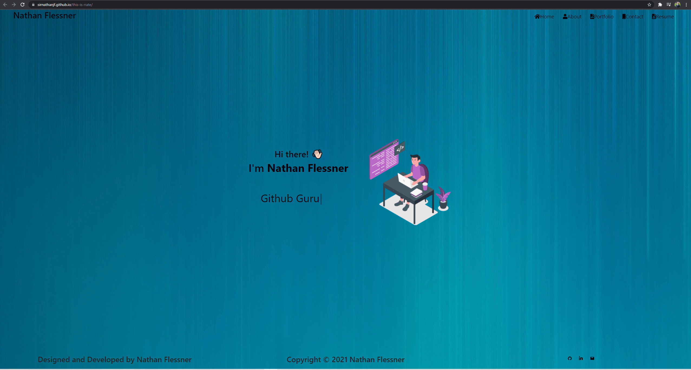

# Unit 20: React Portfolio

### [Live URL](https://sirnathanjf.github.io/this-is-nate/)

## Table of Contents

- [Overview](#overview)
- [Technologies](#technologies)
- [Questions](#questions)
- [License](#license)

## Overview

This is my current portfolio. It was a ton of fun to navigate the challenges of react, and learning different frameworks. It was also very beneficial to do some styling myself via CSS to get it to look just how I wanted. 

## Tech

- ReactJS
- Bootstrap
- Typewriter
- Font Awesome
- Github Pages

## Questions

If you have any questions or concerns feel free to reach out to me at [Github](https://github.com/SirNathanJF) or through email at <nathanflessner@gmail.com>

## License

MIT License

      Copyright (c) 2021, Nathan Flessner

      Permission is hereby granted, free of charge, to any person obtaining a copy
      of this software and associated documentation files (the "Software"), to deal
      in the Software without restriction, including without limitation the rights
      to use, copy, modify, merge, publish, distribute, sublicense, and/or sell
      copies of the Software, and to permit persons to whom the Software is
      furnished to do so, subject to the following conditions:

      The above copyright notice and this permission notice shall be included in all
      copies or substantial portions of the Software.

      THE SOFTWARE IS PROVIDED "AS IS", WITHOUT WARRANTY OF ANY KIND, EXPRESS OR
      IMPLIED, INCLUDING BUT NOT LIMITED TO THE WARRANTIES OF MERCHANTABILITY,
      FITNESS FOR A PARTICULAR PURPOSE AND NONINFRINGEMENT. IN NO EVENT SHALL THE
      AUTHORS OR COPYRIGHT HOLDERS BE LIABLE FOR ANY CLAIM, DAMAGES OR OTHER
      LIABILITY, WHETHER IN AN ACTION OF CONTRACT, TORT OR OTHERWISE, ARISING FROM,
      OUT OF OR IN CONNECTION WITH THE SOFTWARE OR THE USE OR OTHER DEALINGS IN THE
      SOFTWARE.

---